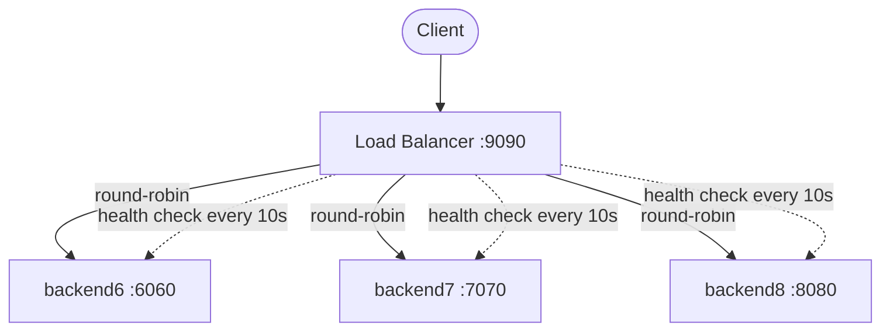

# Go Load Balancer

A simple HTTP load balancer in Go that distributes requests across backend servers using round-robin scheduling with health checks.

## Architecture



The load balancer performs health checks every 10 seconds against each backend's `/api/healthz/` endpoint. Unhealthy backends are automatically removed from rotation and re-added once they recover.

## Running the Demo

### 1. Build and start the containers

```sh
docker compose build
docker compose up
```

### 2. Send requests through the load balancer

```sh
curl http://localhost:9090/
```

You'll see responses rotate between the three backends:

```
hello from backend on port: 6060
hello from backend on port: 7070
hello from backend on port: 8080
hello from backend on port: 6060
...
```

### 3. Toggle a backend to unhealthy

Each backend exposes a toggle endpoint on its own port:

```sh
# Mark backend6 as unhealthy
curl http://localhost:6060/api/toggle-health/

# Mark backend7 as unhealthy
curl http://localhost:7070/api/toggle-health/

# Mark backend8 as unhealthy
curl http://localhost:8080/api/toggle-health/
```

Within 10 seconds the load balancer will detect the change. After that, requests to `http://localhost:9090/` will only be routed to the remaining healthy backends.

### 4. Verify health status

Check any backend's health directly:

```sh
curl -i http://localhost:6060/api/healthz/
```

- **Healthy** — `200 OK` with `{"healthy": true}`
- **Unhealthy** — `500 Internal Server Error` with `{"healthy": false}`

### 5. Restore a backend

Call the toggle endpoint again to flip it back to healthy:

```sh
curl http://localhost:6060/api/toggle-health/
```

The load balancer will pick it up on the next health check cycle.

### 6. All backends down

If every backend is toggled to unhealthy, the load balancer returns:

```
503 Service Unavailable
```

## Ports

| Service    | Port |
|------------|------|
| Load Balancer | 9090 |
| Backend 6  | 6060 |
| Backend 7  | 7070 |
| Backend 8  | 8080 |
